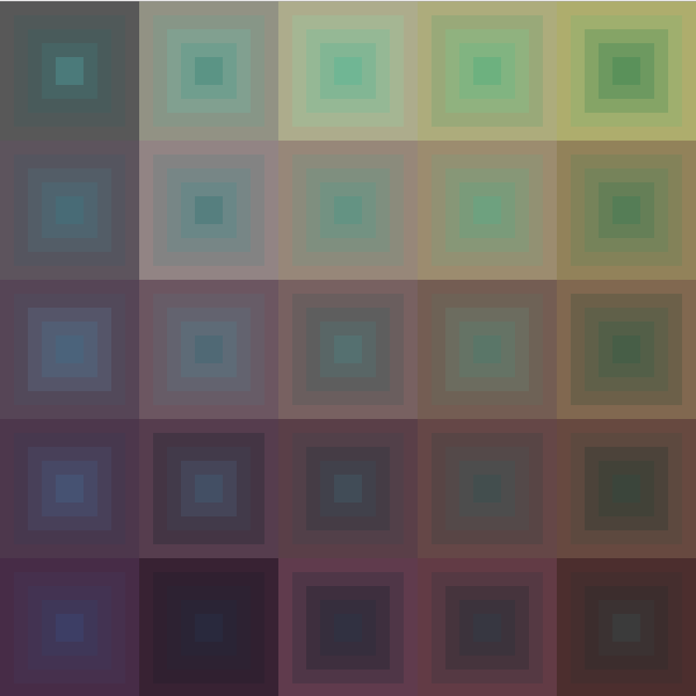

# p5.cmyk.js
CMYK color for p5js



#todo: opacity

```
	//cmyk color channel values are 0.0 to 1.0
	let a = new Cmyk(1.0, 1.0, 1.0, 0.5 ); //make a new cmyk color
	let b = new Cmyk(0.1, 0.5, 0.0, 0.7 ); //make a new cmyk color
	a = a.lerp(b);//lerp from one cmyk to another cmyk
	let c = a.toRgb(); // convert to rgb format
	stroke(c.r, c.g, c.b); // use the new color data
```
